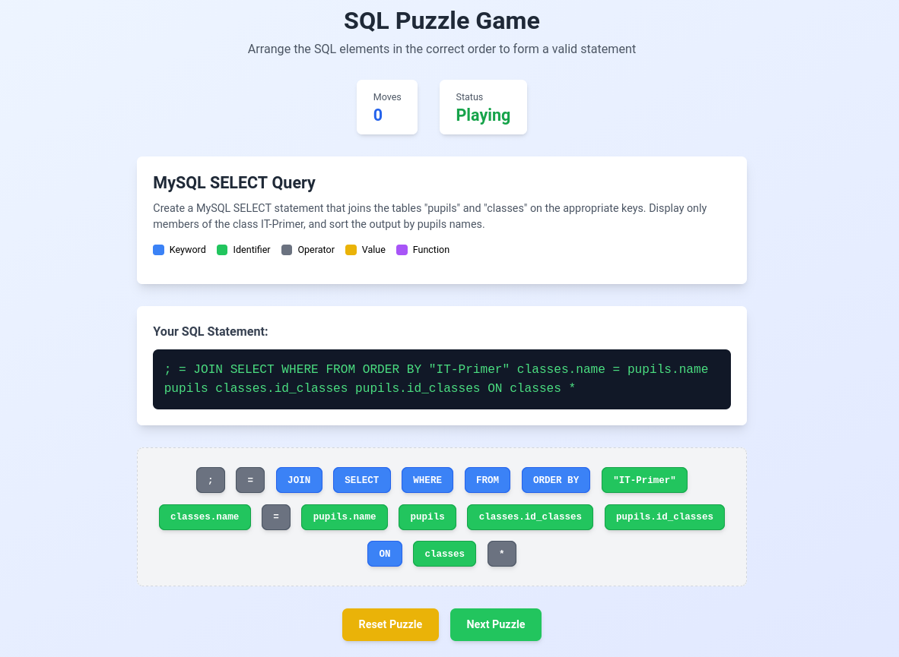

# About this project

This project is a puzzle game where the player has to arrange the SQL elements in the correct order.

Puzzles are currently definied in `puzzleData.ts`.

Currently, it looks like this:



## Technologies used

- React
- TypeScript
- Tailwind CSS

and most of all: Windsurf AI 🕺

# Deployment

To deploy:

```bash
npm install
npm run build
# run a docke container
docker run --rm -p 8080:80 -v ./build:/usr/local/apache2/htdocs httpd:latest
```

## Available Scripts

In the project directory, you can run:

### `npm run dev`

Runs the app in the development mode.\
Open [http://localhost:3000](http://localhost:3000) to view it in the browser.

The page will reload if you make edits.\
You will also see any lint errors in the console.

### `npm test`

Launches the test runner in the interactive watch mode.\
See the section about [running tests](https://facebook.github.io/create-react-app/docs/running-tests) for more information.

### `npm run build`

Builds the app for production to the `build` folder.\
It correctly bundles React in production mode and optimizes the build for the best performance.

See the section about [deployment](https://facebook.github.io/create-react-app/docs/deployment) for more information.


